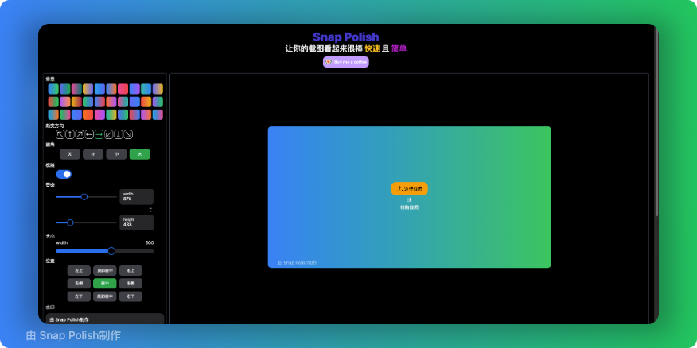

# SnapPolish
让你的截图看起来很棒 快速 且 简单

## 项目简介

SnapPolish 是一个简单易用的截图美化工具，帮助你快速创建专业美观的截图效果。无论是分享代码、展示设计作品，还是制作教程说明，SnapPolish 都能让你的截图更具视觉吸引力。

## ✨ 主要特点

- 🚀 快速简单：简洁的界面设计，操作直观
- 🎨 多样化美化：提供多种美化选项和模板
- 💻 跨平台支持：基于Web技术，支持各种主流浏览器

## 🚀 快速开始

1. 打开 SnapPolish 网页应用
2. 上传或粘贴你的截图
3. 选择喜欢的美化模板
4. 自定义调整效果
5. 下载美化后的图片

## 📝 使用说明

1. **上传图片**
   - 支持拖拽上传
   - 支持剪贴板粘贴
   - 支持本地文件选择

2. **美化选项**
   - 添加背景效果
   - 调整边框和圆角
   - 添加阴影效果
   - 自定义颜色主题

3. **导出分享**
   - 支持多种图片格式
   - 一键复制分享
   - 快速保存本地

## 🤝 贡献

欢迎提交 Issue 和 Pull Request 来帮助改进 SnapPolish！

## 📄 许可证

[MIT License](LICENSE)
